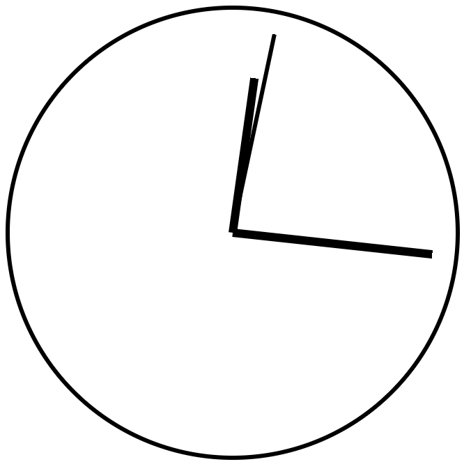

# CSS & DOM Hand Clock
Implement a live hand-clock using only HTML, CSS and JavaScript. If time allows, make sure the various clock hands are easily distinguishable.

## Example:

## Acknowledgment
- PRAMP